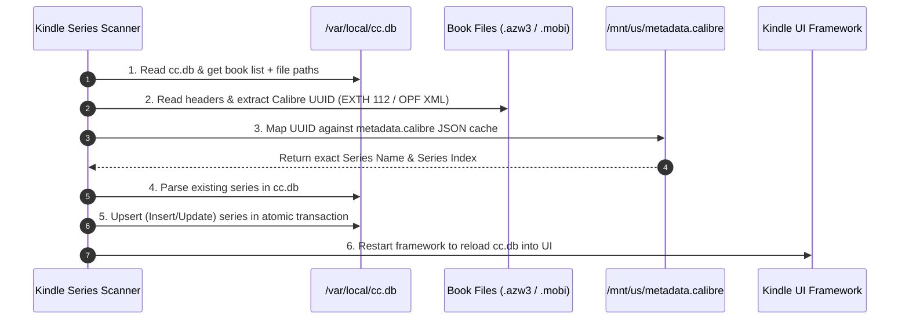

# Kindle Series Scanner (KUAL Extension)

An automated Kindle KUAL extension written in **Lua 5.1.4** to group sideloaded books into native Kindle series using Calibre metadata.

---

## 📖 User Workflow: How to Use

Follow this simple 4-step workflow whenever you add new books with series to your Kindle:


1. **Organize in Calibre**: Add your books to Calibre on your computer and fill in the **Series** and **Number** fields (e.g. `Harry Potter #1`).
2. **Send to Device**: Connect your Kindle via USB and click **"Send to Device"** in Calibre. Calibre will automatically write `/mnt/us/metadata.calibre` containing all series mappings to your Kindle.
3. **Eject & Open KUAL**: Safely disconnect Kindle from your computer, then open **KUAL** on your Kindle.
4. **Run Scanner**: Select **Kindle Series Scanner** → **Scan & Sync Series**.
5. **Wait ~1 Minute**: The Kindle framework will restart. Wait about **1 minute** for background services to finish indexing, then open your **Library** to enjoy your grouped series!

---

## ⚙️ Technical Details: How It Works Under the Hood



1. **Read `cc.db`**: Connects to Kindle's content catalog database (`/var/local/cc.db`) to retrieve all indexed book records, titles, and storage locations (`/mnt/us/documents/...`).
2. **Extract Book UUID**: Fast-reads each book's PalmDB headers and embedded OPF records to extract Calibre's unique identifier (`<dc:identifier id="calibre_id">` or EXTH tag `112`).
3. **Map ID with Calibre Metadata**: Looks up the extracted UUID in `/mnt/us/metadata.calibre` to find the exact `series` name and `series_index` (with fallback to book path and title).
4. **Parse Existing Series**: Reads registered `Entry:Item:Series` collections in `cc.db` to merge books into existing collections without creating duplicates.
5. **Update or Insert (Upsert)**: Executes a safe, atomic SQLite transaction (`BEGIN TRANSACTION; ... COMMIT;`) with a 15-second busy timeout and binary ICU collation bypass to write all series rows directly into `Series` and `Entries` tables.
6. **Restart Framework**: Calls `restart framework` to reload `cc.db` into Kindle's memory, natively rendering series stacks in the Kindle Library.

---

## ⚠️ Important Notice When Running

> [!IMPORTANT]
> When running **Scan & Sync Series**, **Reset / Clean All Series**, or **Restore cc.db**, the Kindle UI framework will restart automatically.
> **It takes about 1 minute for Kindle system services to restart and index the changes.** 
> Please wait a minute after the screen refreshes before opening your Library to see the grouped series.

---

## 🛠️ Prerequisites

1. **Jailbroken Kindle** with **KUAL** (Kindle Unified Application Launcher) installed.
2. **Kindle Setting**:
   - Go to **Settings** → **Device Options** → **Advanced Options** → **Home & Library** → Turn **Group Series in Library** to **ON**.
3. **Calibre Library Cache**:
   - Sideload your books via Calibre at least once so `/mnt/us/metadata.calibre` is created on the device.

---

## 📦 Installation

1. Connect your Kindle to your computer via USB.
2. Copy the entire `kindle-series-scanner` folder into the `extensions` directory on your Kindle's USB storage:
   ```text
   /mnt/us/extensions/kindle-series-scanner/
   ```
3. Safely disconnect / unmount your Kindle from your computer.
4. Open **KUAL** on your Kindle to start using **Kindle Series Scanner**.

---

## 📋 KUAL Menu Options

| Option | Description |
| :--- | :--- |
| **Scan & Sync Series** | Scans books, matches series from `metadata.calibre`, updates `cc.db`, and restarts framework. |
| **Preview / Dry Run** | Simulates the scan without modifying `cc.db` to preview series detection. |
| **View Last Log** | Displays the latest scanner log directly on the Kindle e-ink screen. |
| **Backup cc.db** | Creates a timestamped backup of `cc.db` in `/mnt/us/kindle_db_backup/`. |
| **Restore cc.db** | Restores `cc.db` from the latest backup in `/mnt/us/kindle_db_backup/`. |
| **Diagnose cc.db** | Prints all registered series and member books currently in `cc.db`. |
| **Copy cc.db to /mnt/us** | Copies `/var/local/cc.db` to `/mnt/us/cc.db` so you can inspect it via USB on PC/Mac. |
| **Cleanup Empty Series** | Removes empty or 0-book series from `cc.db`. |
| **Reset / Clean All Series** | Deletes all series collections from `cc.db` and resets all books back to standalone. |

---

## 📱 Tested Devices & Compatibility

- **Kindle Oasis 3 (KOA3)** running the latest firmware.
- Compatible with jailbroken Kindles running firmware 5.12+ with KUAL support.
