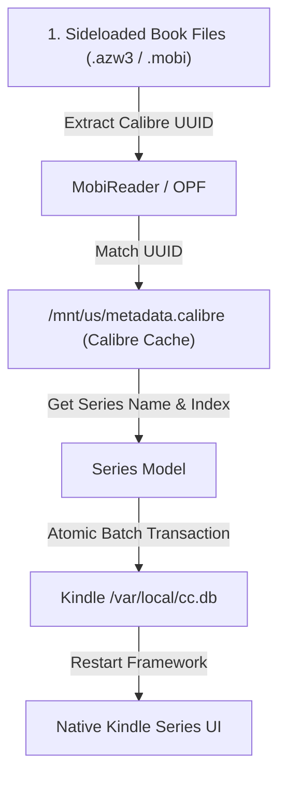

# Kindle Series Scanner (KUAL Extension)

An automated Kindle KUAL extension written in **Lua 5.1.4** to scan sideloaded books, read Calibre metadata cache (`/mnt/us/metadata.calibre`), and group books into native Kindle series in `/var/local/cc.db`.

---

## How It Works



1. **Reads Calibre Cache**: Loads `/mnt/us/metadata.calibre` generated by Calibre when connecting or sending books to Kindle.
2. **Extracts Book Identifiers**: Reads each book's header and OPF records to extract its unique Calibre UUID.
3. **Accurate Series Mapping**: Maps each book's UUID directly to its exact series name and volume number from `metadata.calibre` (with fallback to book file path and title patterns).
4. **Safe Database Synchronization**: Automatically backs up `cc.db` to `/mnt/us/kindle_db_backup/` and performs an atomic SQLite batch insertion into `/var/local/cc.db`.
5. **Native Grouping**: Reloads Kindle's Content Catalog daemon and framework so series appear grouped natively in your Kindle Library.

---

## Prerequisites

1. **Jailbroken Kindle** with **KUAL** (Kindle Unified Application Launcher) installed.
2. **Kindle Setting**:
   - Go to **Settings** → **Device Options** → **Advanced Options** → **Home & Library** → Turn **Group Series in Library** to **ON**.
3. **Calibre Library Cache**:
   - Make sure your books have series information set in Calibre.
   - When Calibre connects to your Kindle, it automatically writes `/mnt/us/metadata.calibre` to the device.

---

## Installation

1. Connect your Kindle to your computer via USB.
2. Copy the entire `kindle-series-scanner` folder into the `extensions` directory on your Kindle:
   ```text
   /mnt/us/extensions/kindle-series-scanner/
   ```
3. Safely disconnect / unmount your Kindle from your computer.
4. Open **KUAL** on your Kindle. You will see **Kindle Series Scanner** in the menu.

---

## ⚠️ Important Notice When Running

> [!IMPORTANT]
> When running **Scan & Sync Series**, **Reset / Clean All Series**, or **Restore cc.db**, the Kindle UI framework will automatically restart to reload the database into memory.
> **It takes about 1 minute for Kindle system services to restart and index the changes.** 
> Please wait a minute after the screen refreshes before opening your Library to see the grouped series.

---

## KUAL Menu Options

| Option | Description |
| :--- | :--- |
| **Scan & Sync Series** | Scans books, matches series from `metadata.calibre`, updates `cc.db`, and restarts framework. |
| **Preview / Dry Run** | Simulates the scan without modifying `cc.db` to preview series detection. |
| **View Last Log** | Displays the latest scanner log directly on the Kindle e-ink screen. |
| **Backup cc.db** | Creates a timestamped backup of `cc.db` in `/mnt/us/kindle_db_backup/`. |
| **Restore cc.db** | Restores `cc.db` from the latest backup in `/mnt/us/kindle_db_backup/`. |
| **Diagnose cc.db** | Prints all registered series and member books currently in `cc.db`. |
| **Copy cc.db to /mnt/us** | Copies `/var/local/cc.db` to `/mnt/us/cc.db` so you can inspect it via USB on PC/Mac. |
| **Cleanup Empty Series** | Removes empty or 0-book series from `cc.db`. |
| **Reset / Clean All Series** | Deletes all series collections from `cc.db` and resets all books back to standalone. |

---

## Extension Structure

```text
extensions/kindle-series-scanner/
├── config.xml                      # KUAL extension manifest
├── menu.json                       # KUAL menu definition
├── bin/
│   ├── scan.sh                     # Scan and sync series into cc.db
│   ├── dry_run.sh                  # Preview detected series without writing
│   ├── view_log.sh                 # View latest log file on Kindle screen
│   ├── backup.sh                   # Backup cc.db to /mnt/us/kindle_db_backup
│   ├── restore.sh                  # Restore cc.db from latest backup
│   ├── diagnose.sh                 # Inspect current series in cc.db
│   ├── copy_db.sh                  # Export cc.db to /mnt/us/cc.db for USB access
│   ├── cleanup.sh                  # Delete empty series with 0 books
│   └── clean_all.sh                # Delete ALL series and reset books to standalone
├── src/
│   ├── main.lua                    # Application entry point & CLI dispatcher
│   ├── config.lua                  # Configuration (database paths, backup folder)
│   ├── utils/
│   │   ├── binary_reader.lua       # Pure Lua 5.1 Big-Endian / Little-Endian unpacker
│   │   ├── palmdoc.lua             # Pure Lua 5.1 PalmDOC LZ77 decompressor
│   │   ├── json.lua                # Pure Lua 5.1 JSON encoder & decoder
│   │   ├── uuid.lua                # UUID v4 generator
│   │   └── logger.lua              # Logging module with Kindle eips screen output
│   ├── models/
│   │   ├── book.lua                # Book entity model
│   │   └── series.lua              # Series grouping model & UTF-8 normalization
│   ├── parsers/
│   │   ├── calibre_reader.lua      # /mnt/us/metadata.calibre JSON reader & UUID indexer
│   │   ├── mobi_reader.lua         # PalmDB header & Record 0 MOBI/EXTH parser
│   │   └── metadata_parser.lua     # Fallback title regex parser
│   ├── db/
│   │   └── sqlite_helper.lua       # SQLite helper with ICU collation bypass & transactions
│   └── services/
│       └── series_scanner.lua      # Core service orchestrating scan and DB synchronization
└── tests/
    ├── test_parser.lua             # Unit tests for metadata and regex parsing
    └── test_end_to_end.lua         # End-to-end integration test for backup and DB upsert
```

---

## SSH / Terminal CLI Usage

You can also run all actions directly via SSH on your Kindle:

```bash
# Preview series detection (Dry run)
/mnt/us/extensions/kindle-series-scanner/bin/dry_run.sh

# Scan and sync series
/mnt/us/extensions/kindle-series-scanner/bin/scan.sh

# Reset all series
/mnt/us/extensions/kindle-series-scanner/bin/clean_all.sh

# Copy cc.db to /mnt/us for inspection on computer
/mnt/us/extensions/kindle-series-scanner/bin/copy_db.sh

# View log
/mnt/us/extensions/kindle-series-scanner/bin/view_log.sh
```

---

## Running Automated Tests Locally

```bash
# Run unit tests
lua tests/test_parser.lua

# Run end-to-end database tests
lua tests/test_end_to_end.lua
```
# indle-series-scanner
